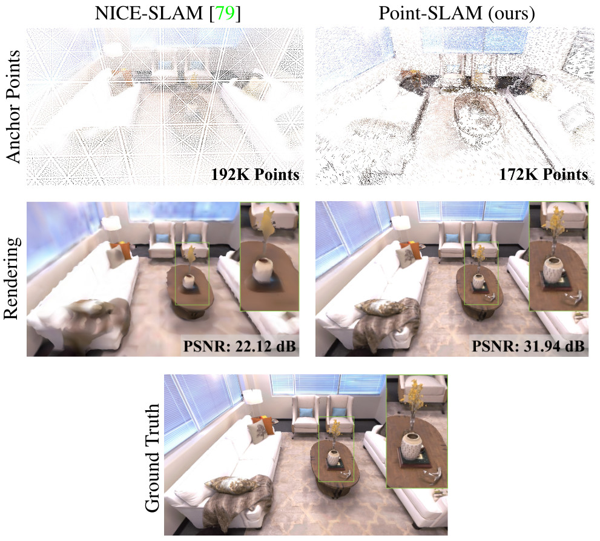
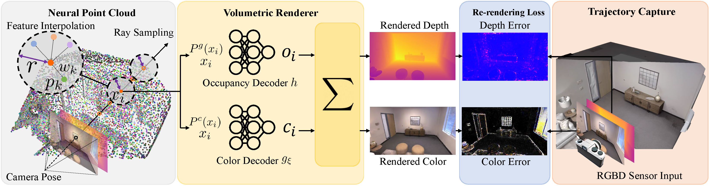

<!-- PROJECT LOGO -->

<p align="center">

  <h1 align="center">Point-SLAM: Dense Neural Point Cloud-based SLAM (ICCV 2023)</h1>
  <p align="center">
    <a href="https://eriksandstroem.github.io/"><strong>Erik Sandström*</strong></a>
    ·
    <a><strong>Yue Li*</strong></a>
    ·
    <a href="https://vision.ee.ethz.ch/people-details.OTAyMzM=.TGlzdC8zMjcxLC0xOTcxNDY1MTc4.html"><strong>Luc Van Gool</strong></a>
    ·
    <a href="http://people.inf.ethz.ch/moswald/"><strong>Martin R. Oswald</strong></a>
  </p>
  <p align="center"><strong>(* Equal Contribution)</strong></p>
  <h3 align="center"><a href="https://arxiv.org/abs/2304.04278">Paper</a> | <a href="https://youtu.be/QFjtL8XTxlU">Video</a> 
  <div align="center"></div>
</p>
<p align="center">
  <a href="">
    
  </a>
</p>
<p align="center">
Point-SLAM produces accurate dense geometry and camera tracking on large-scale indoor scenes.
</p>

<p align="center">
  <a href="">
    
  </a>
</p>
<p align="center">
Due to the spatially adaptive anchoring of neural features, Point-SLAM can encode
high-frequency details more effectively than NICE-SLAM
which leads to superior performance in rendering, recon-
struction and tracking accuracy while attaining competitive
runtime and memory usage. The first row shows the feature anchor points. For NICE-SLAM we show the centers
of non-empty voxels located on a regular grid, while the
density of anchor points for Point-SLAM depends on depth
and image gradients. The row below depicts resulting renderings showing substantial differences on areas with high-
frequency textures like the vase, blinds, floor or blanket.
</p>


<p align="center">
  <a href="">
    
  </a>
</p>
<p align="center">
Point-SLAM Architecture.
</p>

<!-- TABLE OF CONTENTS -->
<details open="open" style='padding: 10px; border-radius:5px 30px 30px 5px; border-style: solid; border-width: 1px;'>
  <summary>Table of Contents</summary>
  <ol>
    <li>
      <a href="#installation">Installation</a>
    </li>
    <li>
      <a href="#run">Run</a>
    </li>
    <li>
      <a href="#evaluation">Evaluation</a>
    </li>
    <li>
      <a href="#acknowledgement">Acknowledgement</a>
    </li>
    <li>
      <a href="#citation">Citation</a>
    </li>
    <li>
      <a href="#contact">Contact</a>
    </li>
  </ol>
</details>


## Installation

First you have to make sure that you have all dependencies in place.
The simplest way to do so is to use [anaconda](https://www.anaconda.com/). 

If you are running Point-SLAM on a cluster GPU without a display, we recommend installing the headless version of Open3D which is required to evaluate the depth L1 metric of the reconstructed mesh. This requires compiling Open3D from scratch. The code is tested on Open3D 15.1 and 16.0. If compiling Open3D from scratch, remove the Open3D dependency from the `environmeny.yaml` file.

You can create an anaconda environment called `point-slam-env`.
```bash
conda env create -f environment.yaml
conda activate point-slam-env
```

For evaluating the F-score, download and install [this](https://github.com/eriksandstroem/evaluate_3d_reconstruction_lib) library using pip. 
```bash
git clone https://github.com/tfy14esa/evaluate_3d_reconstruction_lib.git
cd evaluate_3d_reconstruction_lib
pip install .
```

## Data Download

### Replica
Download the data as below and the data is saved into the `./Datasets/Replica` folder. Note that the Replica data is generated by the authors of iMAP (but hosted by the authors of NICE-SLAM). Please cite iMAP if you use the data.
```bash
bash scripts/download_replica.sh
```
To be able to evaluate the reconstruction error, download the ground truth Replica meshes where unseen region have been culled.

```bash
bash scripts/download_cull_replica_mesh.sh
```

### TUM-RGBD
```bash
bash scripts/download_tum.sh
```


### ScanNet
Please follow the data downloading procedure on the [ScanNet](http://www.scan-net.org/) website, and extract color/depth frames from the `.sens` file using this [code](https://github.com/ScanNet/ScanNet/blob/master/SensReader/python/reader.py).

<details>
  <summary>[Directory structure of ScanNet (click to expand)]</summary>
  
  DATAROOT is `./Datasets` by default. If a sequence (`sceneXXXX_XX`) is stored in other places, please change the `input_folder` path in the config file or in the command line.

```
  DATAROOT
  └── scannet
        └── scene0000_00
            └── frames
                ├── color
                │   ├── 0.jpg
                │   ├── 1.jpg
                │   ├── ...
                │   └── ...
                ├── depth
                │   ├── 0.png
                │   ├── 1.png
                │   ├── ...
                │   └── ...
                ├── intrinsic
                └── pose
                    ├── 0.txt
                    ├── 1.txt
                    ├── ...
                    └── ...
```
</details>


We use the following sequences: 
```
scene0000_00
scene0025_02
scene0059_00
scene0062_00
scene0103_00
scene0106_00
scene0126_00
scene0169_00
scene0181_00
scene0207_00
```


## Run
For running Point-SLAM, we recommend using [weights and biases](https://wandb.ai/) for the logging. This can be turned on by setting the `wandb` flag to True in the `configs/point_slam.yaml` file. Also make sure to specify the path `wandb_folder`. If you don't have a wandb account, first create one. Each scene has a config folder, where the `input_folder` and `output` paths need to be specified. Below, we show some example run commands for one scene from each dataset. If you use a batch processing system (e.g [SLURM](https://slurm.schedmd.com/documentation.html)), you might find our `repro.sh` script useful.

### Replica
To run Point-SLAM on the `room0` scene, run the following command. 
```bash
python run.py configs/Replica/room0.yaml
```
After reconstruction, the trajectory error will be evaluated and so will the mesh accuracy along with the rendering metrics.

### TUM-RGBD
To run Point-SLAM on the `freiburg1_desk` scene, run the following command. 
```bash
python run.py configs/TUM_RGBD/freiburg1_desk.yaml
```
After reconstruction, the trajectory error will be evaluated automatically.

### ScanNet

To run Point-SLAM on the `scene0000_00` scene, run the following command. 
```bash
python run.py configs/ScanNet/scene0000_00.yaml
```
After reconstruction, the trajectory error will be evaluated automatically.

### Testing and Development
If you want to develop your own system off of Point-SLAM, we provide a test function to make sure that any changes you do to the codebase produces expected results. The `test_deterministic.py` script runs the code for a limited set of frames and evaluates the map and trajectory against a reference to check whether they are the same. This can be useful when e.g. refactoring.

## Acknowledgement
Our codebase is partially based on [NICE-SLAM](https://github.com/cvg/nice-slam) and we thank the authors for making this codebase publicly available. Our work would not have been possible without your great efforts!

## Reproducibility
There may be minor differences between the released codebase and the results reported in the paper. Further, we note that the GPU hardware has an influence, despite running the same seed and conda environment.

## Citation

If you find our code or paper useful, please cite
```bibtex
@inproceedings{Sandström2023ICCV,
  author    = {Sandström, Erik and Li, Yue and Van Gool, Luc and R. Oswald, Martin},
  title     = {Point-SLAM: Dense Neural Point Cloud-based SLAM},
  booktitle = {Proceedings of the IEEE/CVF International Conference on Computer Vision (ICCV)},
  year      = {2023}
}
```
## Contact
Contact [Erik Sandström](mailto:erik.sandstrm@gmail.com) or [Yue Li](mailto:clap4jack@gmail.com) for questions, comments and reporting bugs.


